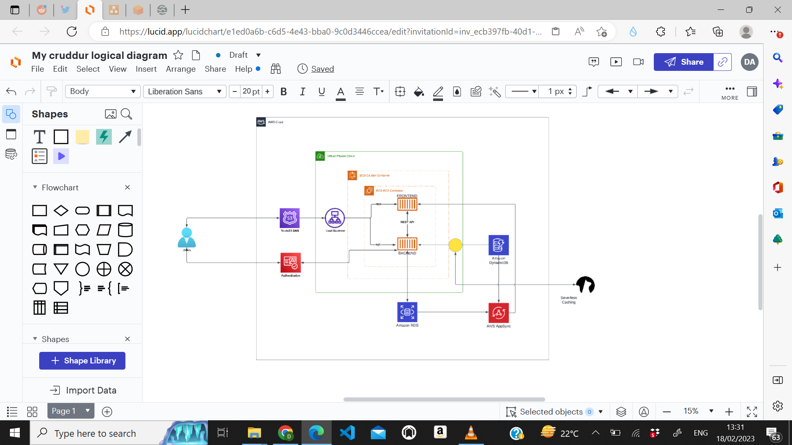
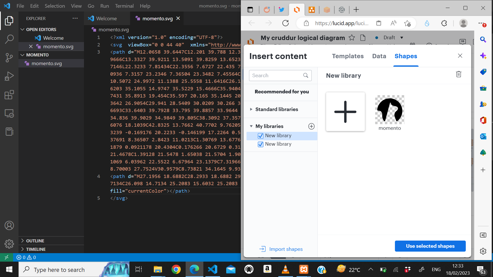
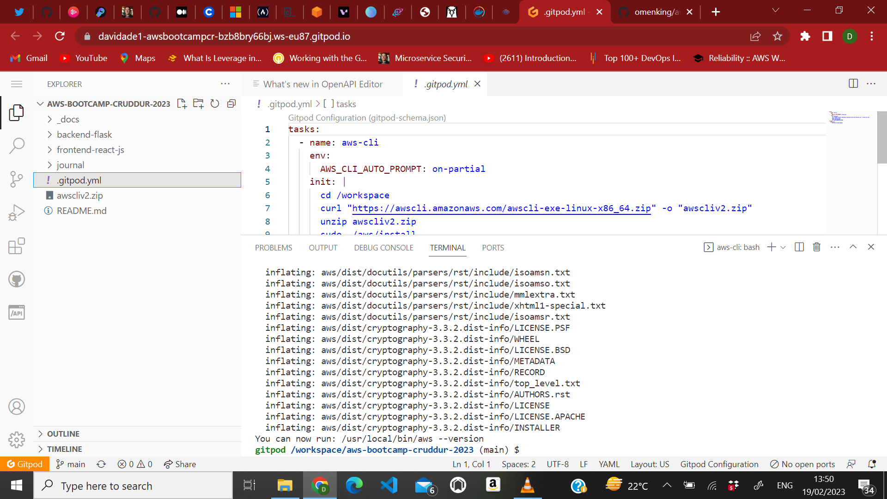
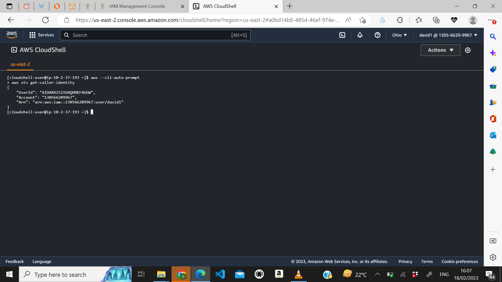

# Week 0 — Billing and Architecture

## CREATING THE LOGICAL DIAGRAM OF THE CRUDDUR APP WITH LUCID CHART 

### I created a free trial account on ```lucid.app```  and started exploring the website,it was not hard to get around the website,so it was an easy task for me to achieve,i got to know how to import recent templates and shapes from different cloud platforms like AWS,GCP,Azure and different basic shapes.Below is the screenshot to the logical architectural diagram i created.

## PROBLEM ENCOUNTERED DURING THE LOGICAL DESIGN
### I was clueless on how to import the momento servelesss caching logo to my logical design,then i watched the video guide from ExamPro and i got to know how to copy the html code from the momento website and save it with the svg extension.I encounted a problem while importing the image and it was blank,then i edited the file on my VSCode editor added this line of code below
```
<?xml version="1.0" encoding="UTF-8"
```

## AWS CLI INSTALL TO GITPOD
### i was able to succesfully install the AWS CLI to my gitpod extension on my browser and set the environment vairables of my new IAM user account 


## OPENING AWS CLOUD SHELL
### i opened the aws cloudshell in the us-east-2 region and i ran the following commands
```
aws sts get-caller-identity
aws --cli-auto-prompt
```


## CREATING BUGDET
### i created a budget using the aws cli in gitpod and i was so much fun,i created three .json files in json folder and i understood the contents of the files.I needed to make sure i was in the right account,so i ran the ```aws sts get-caller-identity``` command in the cli and i was in my IAM user account,i set the budget limit amount to $1 in the ```budget.json``` file and changed my email in the ```budget-notifications-with-subscribers.json``` file.Afterwards i ran the following command to create budget
```
aws budgets create-budget \
    --account-id 130566209967 \
    --budget file://aws/json/budget.json \
    --notifications-with-subscribers file://aws/json/budget-notifications-with-subscribers.json
```


