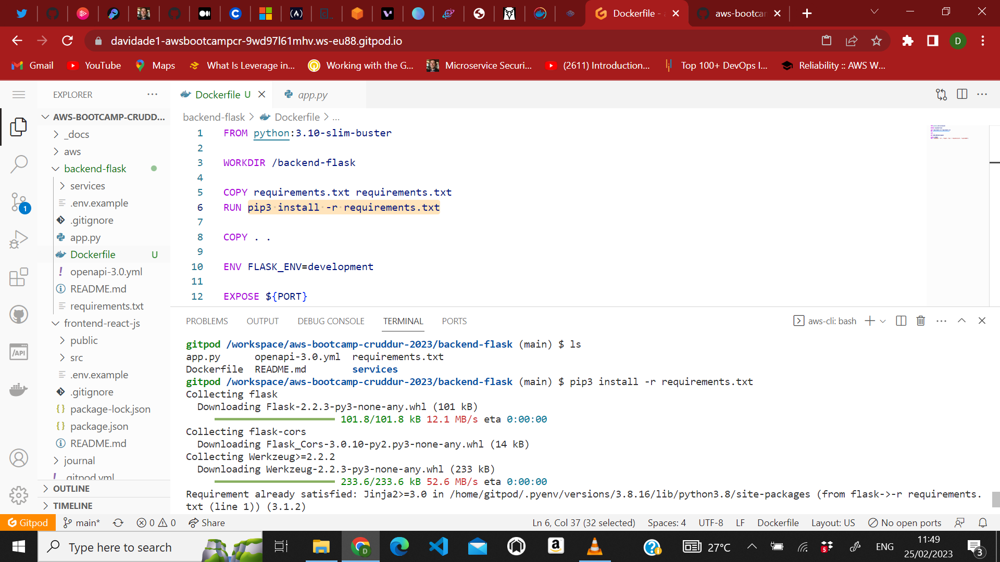
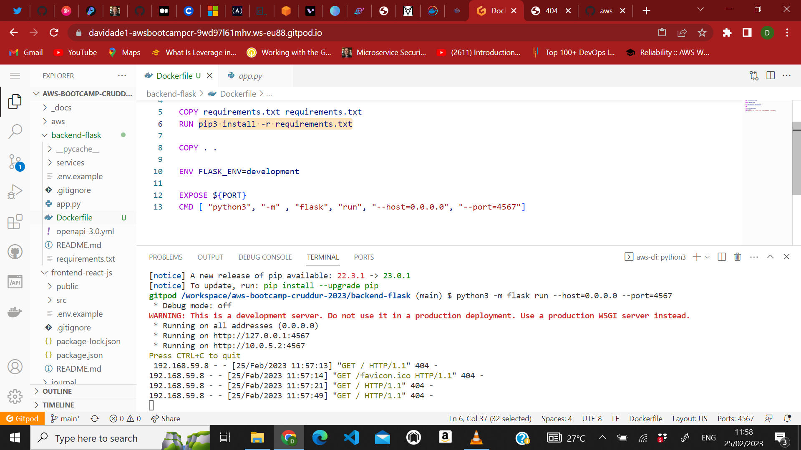
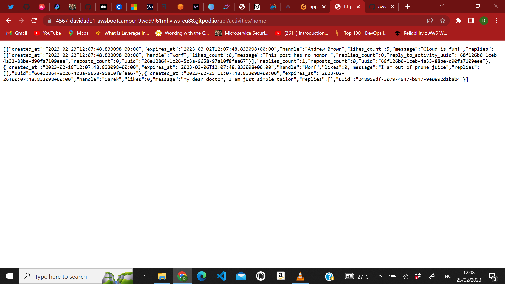

# Week 1 — App Containerization
## CONTAINERIZE BACKEND
## Adding dockerfile
### so i created a ```dockerfile``` in the ```/backend-flask``` folder and wrote the following line of codes in the file 
```
FROM python:3.10-slim-buster

WORKDIR /backend-flask

COPY requirements.txt requirements.txt
RUN pip3 install -r requirements.txt

COPY . .

ENV FLASK_ENV=development

EXPOSE ${PORT}
CMD [ "python3", "-m" , "flask", "run", "--host=0.0.0.0", "--port=4567"]
```
### Then i followed the instructions in the docker file and used the ``` cd backend/``` to change the working dirctory and ran the ```pip3 install -r requirements.txt``` command to install the python libraries of the application 

### Then i ran the last command,which was ```python3 -m flask run --host=0.0.0.0 --port=4567``` to start up the application on port ```4567``` but i was getting a 404 error but i knew the development server was working since i was seeing the activities on the server 

### So i set the Environment variables for the frontend and backend of the application to solve the error with the following commands 
```
export FRONTEND_URL="*"
export BACKEND_URL="*"
```
### Now the server is running with some data 

