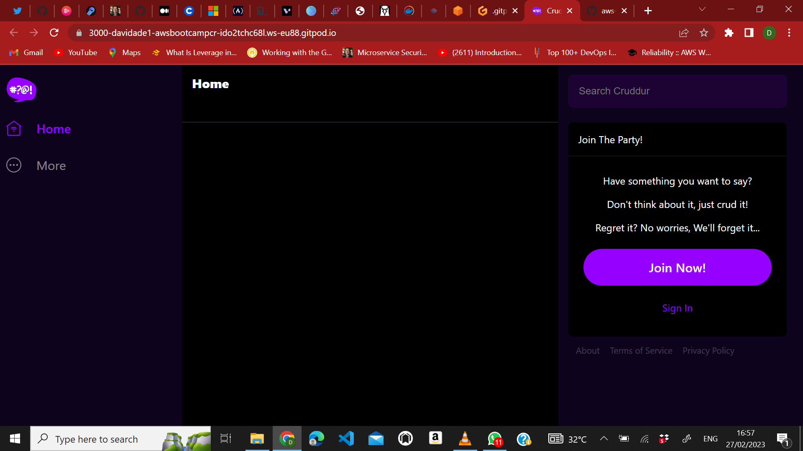

# Week 1 — App Containerization
## CONTAINERIZE BACKEND
## Adding dockerfile
### so i created a ```dockerfile``` in the ```/backend-flask``` folder and wrote the following line of codes in the file 
```
FROM python:3.10-slim-buster

WORKDIR /backend-flask

COPY requirements.txt requirements.txt
RUN pip3 install -r requirements.txt

COPY . .

ENV FLASK_ENV=development

EXPOSE ${PORT}
CMD [ "python3", "-m" , "flask", "run", "--host=0.0.0.0", "--port=4567"]
```
### Then i followed the instructions in the docker file and used the ``` cd backend/``` to change the working dirctory and ran the ```pip3 install -r requirements.txt``` command to install the python libraries of the application 

### Then i ran the last command,which was ```python3 -m flask run --host=0.0.0.0 --port=4567``` to start up the application on port ```4567``` but i was getting a 404 error but i knew the development server was working since i was seeing the activities on the server 

### So i set the Environment variables for the frontend and backend of the application to solve the error with the following commands 
```
export FRONTEND_URL="*"
export BACKEND_URL="*"
```
### Now the server is running with some data 


## BUILD CONTAINER IMAGES OF BACKEND
### I used the following command to build the container image ```docker build -t  backend-flask ./backend-flask``` but i needed to be in the main directory of the application to build a container for ```/backend-flask```

### Now the container image of ```backend-flask``` would be available in the docker page of my gitpod VSCODE

## RUN CONTAINER
### I used the following command to run the container and set the environment variable of ```FRONTEND_URL & BACKEND_URL```
```
docker run --rm -p 4567:4567 -it -e FRONTEND_URL='*' -e BACKEND_URL='*' backend-flask
```

## GETTING CONTAINER IMAGES AND RUNNING CONTAINER IDS
### I used ```docker images``` command to get the number images in my gitpod and ```docker ps``` to get the running containers in my gitpod

## CONTAINERIZE FRONTEND
## Adding a dockerfile
### So i created a dockerfile in the ```/frontend-react-js``` folder and i wrote the following line of codes in it
```
FROM node:16.18

ENV PORT=3000

COPY . /frontend-react-js
WORKDIR /frontend-react-js
RUN npm install
EXPOSE ${PORT}
CMD ["npm", "start"]
```

## Build multiple containers
### I created a ````docker-compose.yml``` file in the root folder of the app and i wrote the following codes in the file
```
version: "3.8"
services:
  backend-flask:
    environment:
      FRONTEND_URL: "https://3000-${GITPOD_WORKSPACE_ID}.${GITPOD_WORKSPACE_CLUSTER_HOST}"
      BACKEND_URL: "https://4567-${GITPOD_WORKSPACE_ID}.${GITPOD_WORKSPACE_CLUSTER_HOST}"
    build: ./backend-flask
    ports:
      - "4567:4567"
    volumes:
      - ./backend-flask:/backend-flask
  frontend-react-js:
    environment:
      REACT_APP_BACKEND_URL: "https://4567-${GITPOD_WORKSPACE_ID}.${GITPOD_WORKSPACE_CLUSTER_HOST}"
    build: ./frontend-react-js
    ports:
      - "3000:3000"
    volumes:
      - ./frontend-react-js:/frontend-react-js

# the name flag is a hack to change the default prepend folder
# name when outputting the image names
networks: 
  internal-network:
    driver: bridge
    name: cruddur
```

### After creating the docker-compose.ymal file,i went to my terminal and ran the ```cd frontend-react-js/``` command to enter the directory,then i ran the ```npm install``` command.I right-clicked on the ```docker-compose.yml``` file in the parent directory and selected the compose up option,this started two containers(aws-bootcamp-cruddur-2023-backend-flask & aws-bootcamp-cruddur-frontend-react-js)

### i opened the ```aws-frontend-react-js``` container in my browser and the port ```3000``` was working perfectly but it wasn't communicating with the backend.

### I couldn't get the issue resolved,so i asked for help in the discord server and someone was kind enough to put me through and i got the problem resolved by making ports ```3000``` and ```4567``` visbility from private to public.I used the following commands to achieve this 
```
gp ports visibility 4567:public
gp ports visibility 3000:public
```


